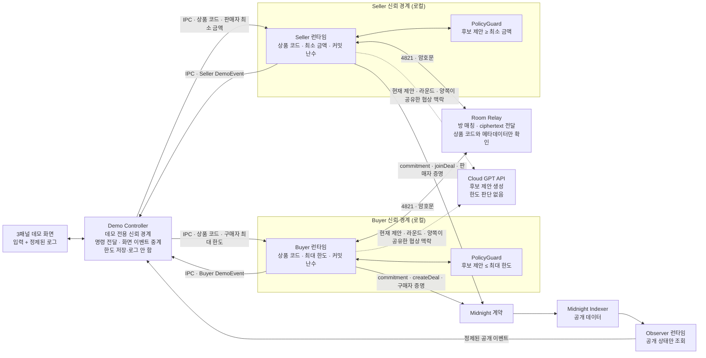

# Midnight Private Negotiation DApp v2 설계

**작성일:** 2026-07-25

**상태:** 승인된 통합 설계

**대상:** 새 3패널 웹 DApp, 역할별 에이전트 런타임, 암호화 Room Relay, Midnight 계약·Observer

**이전 버전:** 기존 구현은 로컬 작업 공간의 `v1/`에만 보존하며 Git 추적과 원격 저장소에서는 제외한다.

## 1. 목적

구매자와 판매자가 같은 4자리 상품 코드로 협상방에 참여하고 각자의 가격 한도를 역할별 로컬 private state에 저장한다. 두 AI 에이전트는 정확한 한도를 모델에 전달하지 않은 채 후보 가격을 생성하고, 로컬 `PolicyGuard`가 전송·수락 가능 여부를 집행한다.

협상이 성립하면 Midnight 회로가 다음 조건을 한도 원문 공개 없이 증명한 뒤 최종 합의 금액만 공개한다.

```text
합의 가격 p

p <= 구매자 최대 한도
판매자 최소 금액 <= p
```

발표에서 기억시킬 문장은 다음과 같다.

> 구매·판매 한도는 상대방과 공개 체인에 공개되지 않고, 협상이 성사되면 합의 금액만 온체인에 남는다.

## 2. 버전 경계와 저장소 구조

Counter 예제를 기반으로 만든 기존 데모는 로컬 작업 공간의 `v1/` 아래에 실행 가능한 상태로 보존한다. `v1/`은 `.gitignore`로 제외하며 원격 저장소에는 v2 코드와 문서만 유지한다. 새 코드에서는 `counter`, `counter-cli`, `example-counter` 같은 레거시 명칭을 사용하지 않는다.

```text
.
├── v1/                              # 로컬 전용 기존 데모(gitignored)
├── apps/
│   └── demo-web/                    # 새 3패널 웹 DApp
├── packages/
│   ├── agent-core/                   # 한도 비인지 GPT mock·로컬 PolicyGuard
│   ├── demo-controller/             # 실행 제어와 정제된 화면 이벤트 중계
│   ├── buyer-runtime/               # Buyer private state·GPT·PolicyGuard
│   ├── seller-runtime/              # Seller private state·GPT·PolicyGuard
│   ├── room-relay/                  # 방 매칭과 암호문 전달
│   ├── observer-runtime/            # Indexer 공개 상태 조회
│   ├── negotiation-contract/        # 새 Compact 계약
│   └── protocol/                    # 명령·이벤트·암호화 envelope 타입
├── .calm-design/                    # 디자인 컨텍스트와 디자인 시스템
├── .superdesign/                    # 3패널 시각 설계
└── docs/                            # v2 설계·계획
```

`apps/`와 `packages/`는 구현 계획 승인 후 생성한다.

### 로컬 v1 아카이브 구현 기준

- `v1/agents/buyer.ts`와 `v1/agents/seller.ts`를 사용하는 경량 데모·단위 테스트는 한 Node.js 프로세스 안에서 두 객체를 함께 실행한다.
- 실제 Midnight 통합 경로인 `v1/counter-cli/src/isolation/orchestrator.ts`는 `buyer-runtime.ts`, `seller-runtime.ts`, `observer-runtime.ts`를 각각 `child_process.fork()`로 실행한다.
- v2는 두 방식 중 후자를 계승한다. Buyer, Seller, Observer는 서로 다른 PID를 가진 별도 프로세스여야 하며, 한 프로세스가 양쪽 private state를 함께 보유하는 구현은 허용하지 않는다.

## 3. 사용자와 사용 맥락

### 직접 사용자

- 한 사람이 Buyer와 Seller 입력을 모두 조작한다.
- 화면을 녹화해 발표용 데모 영상을 만든다.
- 별도의 역할 선택 화면 없이 Buyer·Seller 패널 자체가 역할을 나타낸다.

### 영상 시청자

- 블록체인·ZK 경험이 섞인 기술 청중이다.
- 내부 PID, 지갑 주소, prover URL, 필드 목록, relay audit 원문보다 프라이버시 경계를 직관적으로 이해해야 한다.

### 발표자용 합성 화면의 한계

세 패널을 한 화면에 합성하므로 발표자와 영상 시청자는 입력 시점의 Buyer 최대 한도와 Seller 최소 금액을 볼 수 있다. 이 화면은 역할 격리를 설명하는 발표자용 관찰 화면이지, 인간 발표자로부터 양쪽 한도를 숨기는 운영 UI가 아니다.

운영형 제품으로 확장할 때는 Buyer와 Seller 화면을 별도 세션으로 분리해 각 사용자가 자기 한도만 보도록 한다.

## 4. 핵심 화면 구조

화면은 Midnight 헤더와 Buyer, Seller, Observer 세 패널로만 구성한다. 패널 순서는 고정한다.

```text
┌──────────────────────────────────────────────────────────────┐
│ MIDNIGHT | 비공개 협상 데모                                  │
├──────────────────┬──────────────────┬────────────────────────┤
│ BUYER            │ SELLER           │ OBSERVER               │
│ 역할별 입력      │ 역할별 입력      │ 공개 상태              │
│ 정제된 로그      │ 정제된 로그      │ 정제된 공개 로그       │
└──────────────────┴──────────────────┴────────────────────────┘
```

세 패널의 같은 폭은 일반적인 3열 기능 카드가 아니라 서로 다른 신뢰 경계를 동시에 비교하기 위한 프로토콜 시각화다.

## 5. 역할별 입력 상태

Buyer와 Seller는 각자 자기 패널에서 동일한 4자리 상품 코드를 입력한다. 공용 상품 코드 입력은 사용하지 않는다.

### 프로그램 시작 전

페이지를 열었을 때는 Buyer·Seller·Observer 패널의 터미널 외곽만 표시한다. 입력 행, 상태 문구, 샘플 로그를 자동으로 생성하지 않는다. Demo Controller가 세 역할 프로세스의 `RUNTIME_READY`를 모두 검증하면 `READY_FOR_INPUT` UI 상태로 전환하고 Buyer·Seller 상품 코드 입력을 동시에 표시한다.

### Buyer

```text
입장 전
상품 코드  [ _ _ _ _ ]

코드 4821 입력 후
4821  ·  구매자 최대 한도  [             ] KRW

한도 110,000 입력 후
4821  ·  구매자 최대 한도  🔒 110,000 KRW
```

### Seller

```text
입장 전
상품 코드  [ _ _ _ _ ]

코드 4821 입력 후
4821  ·  판매자 최소 금액  [             ] KRW

금액 95,000 입력 후
4821  ·  판매자 최소 금액  🔒 95,000 KRW
```

### 입력 규칙

- 상품 코드는 숫자 네 자리다.
- Enter 또는 패널 내부 확인 동작으로 방에 입장한다.
- 코드를 제출하면 같은 위치가 역할별 한도 입력 행으로 전환된다.
- 금액은 양의 정수 KRW이며 표시할 때 천 단위 구분 쉼표를 사용한다.
- 금액 제출 후 해당 행은 잠긴 읽기 상태가 된다.
- 한도를 잠근 직후 해당 역할에 `상대방의 입력을 기다리고 있습니다.`를 표시한다.
- Controller는 웹에서 받은 한도 명령을 대상 런타임에 즉시 전달하고 원문을 보관·로그하지 않으며, 이후에는 Buyer·Seller의 `LIMIT_LOCKED` 상태만 확인한다.
- 같은 상품 코드의 두 역할이 모두 `LIMIT_LOCKED`가 되면 양쪽에 `PEER_READY`를 보내 다음 단계로 진행한다.
- 한 역할이 늦게 입장했을 때 상대 commitment가 이미 준비되어 있으면 금액 없이 상대 commitment 등록 완료 이벤트를 해당 역할에 즉시 동기화한다. 이 경우 이미 충족된 commitment에 대한 대기 로그는 표시하지 않는다.
- 사용자가 보는 방 식별자는 네 자리 상품 코드지만 내부 session ID에는 브라우저 데모 인스턴스 ID를 포함한다. 새 페이지 실행에서 같은 상품 코드를 다시 사용해도 이전 실행의 상태·타이머·commitment와 합쳐지지 않는다.
- 자물쇠는 “이 역할의 로컬 private state에 저장됨”을 뜻한다.
- 잠긴 금액은 해당 역할 패널에는 그대로 보인다.
- 상대 역할 런타임, Relay, GPT 입력, Observer 로그에는 한도를 전달하지 않는다.
- 값을 바꾸려면 현재 실행을 명시적으로 초기화하고 새 세션으로 시작한다.

## 6. 전체 실행 흐름

```text
Buyer·Seller가 같은 상품 코드 입력
→ 각자 한도 입력 및 로컬 private state 잠금
→ Buyer commitment 생성 및 createDeal
→ Seller commitment 생성 및 joinDeal
→ 역할별 GPT가 후보 제안 생성
→ 각 PolicyGuard가 로컬 한도로 후보 검사
→ 통과한 협상 메시지만 암호화하여 Relay 전송
→ 최대 10라운드 안에 합의 또는 결렬
→ 합의 시 Buyer 조건 증명
→ 합의 가격 opening을 Seller에게 암호화 전달
→ Seller 조건 증명 및 settle
→ Indexer 확인 후 최종 금액 표시
```

## 7. 시스템 아키텍처



## 8. 컴포넌트 책임

### 8.1 Demo Web

- 하나의 WebSocket 연결로 역할이 표시된 명령을 Demo Controller에 전달한다.
- Buyer와 Seller 입력을 브라우저 저장소, 분석 도구, 콘솔에 기록하지 않는다.
- 역할 런타임과 Observer가 발행한 정제된 이벤트만 렌더링한다.
- 협상 원문, GPT 프롬프트, 후보 목록, 폐기 결과를 렌더링하거나 브라우저 로그에 기록하지 않는다.

### 8.2 Demo Controller

- Buyer, Seller, Observer 런타임을 각각 별도 자식 프로세스로 시작한다.
- 웹 명령을 대상 역할 프로세스의 IPC로 즉시 전달한다.
- 역할 런타임 시작·중지·초기화 명령을 전달한다.
- 각 프로세스의 `DemoEvent`를 검증한 뒤 WebSocket으로 해당 패널에만 중계한다.
- 최대·최소 한도는 IPC 전달 중 일시적으로 수신하지만 상태, 파일, 로그, 오류 추적 도구에 보관하지 않는다.
- commitment randomness와 역할 비밀 키는 수신하지 않는다.
- 역할 프로세스의 raw stdout을 웹으로 중계하지 않는다.
- 성공 상태는 Seller의 `settle` 호출과 Indexer의 `SETTLED` 확인이 모두 끝난 뒤에만 발행한다.

Demo Controller는 로컬 데모의 신뢰 경계에 포함된다. 따라서 데모가 보장하는 비공개 대상은 상대 역할 런타임, Room Relay, GPT API, 공개 체인이며, Controller로부터도 한도를 숨기는 구조는 프로덕션용 역할별 클라이언트에서 별도로 다룬다.

### 8.2.1 프로세스와 웹 이벤트 배선

```text
Browser
  └─ WebSocket command
       └─ Demo Controller (parent)
            ├─ child.send(BuyerCommand)  → Buyer Runtime
            ├─ child.send(SellerCommand) → Seller Runtime
            └─ child.send(ObserveCommand)→ Observer Runtime

Buyer/Seller/Observer Runtime
  └─ process.send(DemoEvent)
       └─ Demo Controller validation
            └─ WebSocket panel event
                 └─ Buyer/Seller/Observer panel
```

- 로그 push 지점은 각 역할 런타임의 `process.send(DemoEvent)`다.
- WebSocket push 지점은 Demo Controller의 검증된 이벤트 라우터다.
- 이벤트의 `panel` 값만 신뢰하지 않고, 이벤트를 보낸 자식 프로세스의 고정 역할과 일치하는지 검사한다.
- 역할 프로세스 종료 시 해당 패널에 정제된 오류 이벤트를 한 번만 발행한다.

### 8.3 Buyer Runtime

- 상품 코드, 최대 한도, Buyer 역할 키, commitment randomness, 합의 가격 opening을 자기 private state에 저장한다.
- Buyer GPT 요청을 독립된 stateless 요청으로 생성한다.
- Buyer `PolicyGuard`로 후보 가격과 수락 가능 여부를 검사한다.
- `createDeal`과 `authorizeHiddenPrice`를 호출한다.

### 8.4 Seller Runtime

- 상품 코드, 최소 금액, Seller 역할 키, commitment randomness를 자기 private state에 저장한다.
- Seller GPT 요청을 Buyer와 분리된 stateless 요청으로 생성한다.
- Seller `PolicyGuard`로 후보 가격과 수락 가능 여부를 검사한다.
- `joinDeal`과 `settle`을 호출한다.

### 8.5 Room Relay

- 네 자리 상품 코드로 Buyer와 Seller를 같은 방에 매칭한다.
- 역할당 하나의 활성 연결만 허용한다.
- 상품 코드, 역할, 순서 번호, nonce, ciphertext만 전달한다.
- 암호문을 복호화하지 않으며 가격·대화·opening을 로그하지 않는다.
- 메시지 순서와 중복만 검사한다.

### 8.6 Observer Runtime

- 계약 주소와 Indexer endpoint만 입력받는다.
- 지갑, private state, proof server, GPT, Relay 복호화 키를 갖지 않는다.
- `WAITING_SELLER → OPEN → AUTHORIZED → SETTLED/CANCELLED` 공개 상태만 조회한다.
- `AUTHORIZED`에서는 `가격 커밋 등록(금액 비공개)`를 표시해 가격이 아직 공개되지 않았음을 명시한다.
- 최종 가격은 `SETTLED`에서만 표시한다.

## 9. GPT 데이터 경계

GPT는 정책 집행자가 아니라 후보 생성기다.

### 허용 입력

```json
{
  "productCode": "4821",
  "round": 2,
  "role": "buyer",
  "sharedOffer": "100000",
  "sharedHistory": [
    { "round": 1, "action": "offer", "price": "95000" },
    { "round": 1, "action": "counter", "price": "100000" }
  ]
}
```

### 금지 입력

- Buyer 최대 한도
- Seller 최소 금액
- commitment randomness
- 역할 비밀 키와 지갑 seed
- `PolicyGuard` 통과·실패 결과
- 폐기된 후보와 폐기 횟수
- 상대 역할의 private state

### 출력

GPT는 최대 다섯 개의 후보를 우선순위 순으로 반환한다.

```json
{
  "candidates": [
    { "action": "counter", "price": "100000" },
    { "action": "counter", "price": "98000" }
  ]
}
```

- 출력은 구조화 스키마로 검증한다.
- 자연어 추론이나 chain-of-thought는 요청·Relay·화면 로그에 사용하지 않는다.
- 상대의 현재 제안이 로컬 조건을 만족하면 `PolicyGuard`가 직접 `accept`를 결정한다.
- GPT가 `accept`를 지시하더라도 로컬 정책 검사를 통과하지 않으면 실행하지 않는다.

### API 저장 설정

- Responses API 요청은 `store: false`로 설정한다.
- `store: false`는 요청 단위 application state 저장을 끄는 설정이며 조직 단위 Zero Data Retention과 같지 않다.
- 데모의 클라우드 모델 제공자는 양쪽 에이전트가 이미 공유한 제안과 협상 맥락을 추론 시점에 처리하는 신뢰 경계에 포함된다.
- 정확한 한도는 모델 입력에서 제외되므로 클라우드 모델 제공자도 한도 원문을 받지 않는다.
- 운영 확장 시 같은 모델 어댑터 인터페이스 뒤에 self-hosted 로컬 모델을 연결할 수 있다.

참조: [OpenAI API 데이터 제어](https://developers.openai.com/api/docs/guides/your-data#v1responses)

## 10. Stateless 후보 생성과 폐기

한 턴의 후보 생성 규칙은 다음과 같다.

```text
GPT → 후보 행동/금액 최대 5개 생성
PolicyGuard → 로컬 한도로 순서대로 검사
통과 → 첫 유효 후보를 암호화하여 Relay 전송
실패 → 외부 전송 및 화면·서버 로그 없이 전부 폐기
       이전 후보가 실패했다는 정보 없이 새 stateless 요청 수행
```

### 재요청 규칙

- 한 턴에 최대 세 번의 stateless 요청만 허용한다.
- 각 요청은 같은 공개 협상 상태를 입력으로 사용한다.
- 이전 요청의 후보, 실패 여부, 실패 이유, 시도 번호를 다음 요청에 포함하지 않는다.
- Buyer와 Seller의 API 요청 컨텍스트와 request lifecycle을 완전히 분리한다.
- 폐기와 재요청은 사용자 화면의 협상 스피너 뒤에서만 일어난다.
- 세 요청에서 유효 후보를 얻지 못하면 역할별 로컬 규칙 기반 전략이 안전한 후보나 종료 행동을 만든다.

이 방식은 모델이 반복되는 PolicyGuard 결과를 통해 한도에 관한 정보를 얻는 경로를 차단한다.

## 11. PolicyGuard 규칙

### Buyer

- 수신 제안 `p`가 `p <= buyerMax`이면 수락할 수 있다.
- 송신 후보는 `p <= buyerMax`인 경우에만 전송한다.
- 음수, 0, 정수 범위를 벗어난 값, 스키마가 잘못된 값은 폐기한다.

### Seller

- 수신 제안 `p`가 `sellerMin <= p`이면 수락할 수 있다.
- 송신 후보는 `sellerMin <= p`인 경우에만 전송한다.
- 음수, 0, 정수 범위를 벗어난 값, 스키마가 잘못된 값은 폐기한다.

### 공통

- 정책 판정은 로컬에서만 실행한다.
- 판정 결과는 GPT, Relay, Demo Controller, Observer에 전달하지 않는다.
- 합의 전 가격은 공개 화면 로그와 온체인 ledger에 쓰지 않는다.
- 정책 코드는 GPT 응답보다 우선하고 Midnight 회로가 최종 검증을 담당한다.

## 12. 협상 라운드

최대 협상 라운드는 10이다.

> 하나의 가격 제안과 상대방의 `accept`, `counter`, `reject` 응답까지를 1라운드로 센다.

```text
Round 1: Buyer 제안 → Seller 응답
Round 2: Seller counter → Buyer 응답
Round 3: Buyer counter → Seller 응답
...
Round 10 종료 시 미합의 → CANCELLED
```

- 정상적인 성공 데모는 2~3라운드를 목표로 한다.
- 내부 GPT 재요청은 협상 라운드에 포함하지 않는다.
- 10라운드까지 합의하지 못하면 가격 없이 협상 결렬로 끝낸다.
- 10라운드는 합의를 강제하는 값이 아니라 API 비용, 대기 시간, 무한 반복을 제한하는 운영상 안전장치다.
- 구현에서는 `MAX_NEGOTIATION_ROUNDS=10`처럼 조정 가능한 설정값으로 둔다.
- Buyer·Seller 증명은 합의 후에만 시작한다.

## 13. Relay 암호화

Relay에는 다음 envelope만 평문으로 보인다.

```json
{
  "relayProtocolVersion": 1,
  "sessionId": "room-4821",
  "productCode": "4821",
  "sender": "buyer",
  "target": "seller",
  "sequence": 3,
  "nonce": "base64",
  "ciphertext": "base64",
  "authTag": "base64"
}
```

### 세션 암호화

- 각 역할 런타임은 방 참여 시 임시 X25519 키 쌍을 생성한다.
- Relay를 통해 임시 공개 키만 교환한다.
- 공유 비밀에서 HKDF-SHA-256으로 세션 키를 파생한다.
- 협상 payload는 AES-256-GCM으로 암호화한다.
- `relayProtocolVersion`, `sessionId`, `productCode`, `sender`, `target`, `sequence`는 AAD로 인증한다.
- 모든 메시지는 고유한 96비트 nonce와 단조 증가 sequence를 사용한다.
- 중복 sequence, 재사용 nonce, 인증 태그 실패는 즉시 거부한다.

### 위협 모델

- v2 데모는 Relay를 honest-but-curious로 본다.
- Relay는 정상적으로 키를 전달하지만 암호문 내용을 읽으려 한다고 가정한다.
- 임시 공개 키에 별도 서명·온체인 바인딩이 없으므로 악의적 Relay의 능동적 중간자 공격까지 방어한다고 주장하지 않는다.
- 네 자리 상품 코드는 식별자일 뿐 비밀번호나 키 파생 재료로 사용하지 않는다.
- 운영 버전은 역할 키로 임시 전송 키를 인증하거나 온체인 역할 키와 바인딩해야 한다.

## 14. Midnight 계약 변경

기존 v1 계약은 가격을 `Uint<16>`으로 저장해 `110,000 KRW`를 표현할 수 없다. v2 계약은 한도와 가격을 최소 `Uint<64>`로 확장한다.

### 공개 ledger

- `dealId`
- Buyer 역할 공개 식별자
- Seller 역할 공개 식별자
- Buyer limit commitment
- Seller limit commitment
- agreed-price commitment
- 공개 상태
- `SETTLED` 이후의 final price

### private witness

- Buyer 최대 한도와 randomness
- Seller 최소 금액과 randomness
- 역할별 비밀 키
- 합의 가격과 price randomness

### 상태

```text
WAITING_SELLER
→ OPEN
→ AUTHORIZED
→ SETTLED

어느 완료 전 상태에서든 역할별 취소
→ CANCELLED
```

### 회로 책임

- `createDeal`: Buyer limit commitment로 계약 생성
- `joinDeal`: Seller limit commitment 등록
- `authorizeHiddenPrice`: `agreedPrice <= buyerMax`와 Buyer commitment opening 검증
- `settle`: `sellerMin <= agreedPrice`, Seller commitment opening, price commitment opening 검증
- 성공한 `settle`에서만 final price 공개

## 15. 상품 코드와 dealId

- 사람이 입력하는 상품 코드는 네 자리 방 코드다.
- 네 자리 값만으로 온체인 `dealId`를 만들면 반복 데모가 충돌할 수 있다.
- 실제 `dealId`는 `protocolVersion + roomCode + sessionNonce`를 도메인 분리해 32바이트로 해시한다.
- `sessionNonce`는 Buyer 런타임이 생성하고 Seller에게 방 handshake 일부로 전달한다.
- Observer에는 표시용 상품 코드와 실제 계약 주소를 정제된 공개 이벤트로 연결한다.

## 16. 화면 상태

### 로컬 데모 상태

```text
PRE_START
→ READY_FOR_INPUT
→ ROOM_JOINED
→ LIMIT_LOCKED
→ WAITING_PEER
→ COMMITTING
→ NEGOTIATING
→ BUYER_VERIFYING
→ SELLER_VERIFYING
→ SETTLED | CANCELLED | ERROR
```

### 온체인 상태 매핑

| 화면 상태 | 온체인 상태 | 공개 금액 |
|---|---|---|
| `PRE_START`–`COMMITTING` | 없음 또는 `WAITING_SELLER` | 없음 |
| `NEGOTIATING` | `OPEN` | 없음 |
| `BUYER_VERIFYING` | `OPEN` | 없음 |
| `SELLER_VERIFYING` | `AUTHORIZED` | 없음 |
| `SETTLED` | `SETTLED` | 최종 합의 금액 |
| `CANCELLED` | `CANCELLED` | 없음 |
| `ERROR` | 마지막 확인 상태 | 없음 |

## 17. 화면 이벤트와 로그 계약

역할 런타임과 Observer는 UI에 자유 형식 stdout을 직접 전달하지 않는다. 다음과 같은 정제된 이벤트만 Demo Controller에 보낸다.

`RUNTIME_READY`는 프로세스 제어 메시지이며 사용자 로그가 아니다. Controller가 Buyer·Seller·Observer의 준비 메시지를 모두 확인한 뒤 웹에 `READY_FOR_INPUT` 화면 상태를 한 번만 알린다.

```ts
type DemoEvent = {
  protocolVersion: 1;
  eventId: string;
  occurredAt: string;
  panel: "buyer" | "seller" | "observer";
  sessionId: string;
  audience: "ROLE_LOCAL" | "PARTICIPANTS" | "PUBLIC";
  state:
    | "ROOM_JOINED"
    | "PEER_JOINED"
    | "LIMIT_LOCKED"
    | "WAITING_PEER"
    | "PEER_READY"
    | "COMMITMENT_CREATED"
    | "PEER_COMMITMENT_REGISTERED"
    | "OPEN"
    | "NEGOTIATING"
    | "NEGOTIATION_COMPLETE"
    | "VERIFYING"
    | "FINALIZING"
    | "PROOFS_COMPLETE"
    | "AGREED"
    | "AUTHORIZED"
    | "SETTLED"
    | "CANCELLED"
    | "ERROR"
    | "STOPPED";
  messageCode: string;
  correlationId?: string;
  replaceKey?: string;
  agreedAmount?: string;
  publicAmount?: string;
};
```

- `publicAmount`는 `SETTLED` 이벤트에서만 허용한다.
- `agreedAmount`는 Buyer·Seller의 `AGREED` 공동 이벤트에서만 허용하며 Observer에는 전달하지 않는다.
- `correlationId`는 Buyer·Seller 공동 이벤트의 동일 시각·동일 원인을 검증한다.
- `replaceKey`는 같은 장기 작업의 최신 이벤트를 식별해 이전 행의 스피너만 정지하기 위한 생명주기 식별자다. 기존 로그 행은 삭제·교체하지 않는다.
- `ROLE_LOCAL`은 자기 한도 저장·상대 입력 대기처럼 해당 역할에만 보이는 이벤트다.
- `PARTICIPANTS`는 양쪽 입력 완료·협상 진행처럼 Buyer와 Seller가 공유하는 이벤트다.
- `PUBLIC`은 Observer가 표시하는 공개 계약 이벤트다.
- `audience`는 라우팅 범위이며 문장 전체 색을 결정하지 않는다.
- UI가 `messageCode`를 한국어 문구로 변환한다.
- 자유 형식 예외 메시지, stack trace, 주소, commitment 원문을 그대로 렌더링하지 않는다.
- 모든 사용자용 로그는 `[HH:mm:ss] 메시지` 형식이다.
- 모든 표시 이벤트가 시스템 출력이므로 `[SYSTEM]`, `[BUYER]`, `[SELLER]` 태그를 사용하지 않는다.
- `[PROOF]`, `[CHAIN]`, PID, wallet, prover, raw status 번호는 표시하지 않는다.
- 입력 프롬프트는 로그의 마지막 줄에만 표시하며 Enter 후 입력 줄을 삭제한다. 상품 코드와 자기 한도는 상단 고정 상태 줄에만 반영한다.
- 일반 문장은 `#FFFFFF`, 시간은 `#A8A8A8`, 비공개 입력 라벨은 `#D0B36C`다.
- 화면에 표시되는 `commitment`, `OPEN`, `AUTHORIZED` 같은 프로토콜 토큰만 `#9A9AFF`로 표시한다. 내부 `createDeal`, `joinDeal` 이벤트는 브라우저 스트림에서 제외한다.
- Observer의 `SETTLED · 최종 금액` 한 줄만 `#9FB8A3`로 표시한다.
- `결렬`, `CANCELLED`, 오류 식별자는 `#D65C5C`로 표시한다.

### 진행 로그

```text
[09:41:02] 상품 코드 4821 협상방에 입장했습니다.
[09:41:03] 판매자의 거래 참여를 기다리고 있습니다. ⠋
[09:41:08] 구매자 조건을 로컬 비공개 상태에 저장했습니다.
[09:41:08] 구매자 commitment를 생성했습니다.
[09:41:09] 판매자 commitment 등록을 기다리고 있습니다. ⠋
[09:41:12] 판매자 commitment가 등록되었습니다.
[09:41:13] 협상을 시작합니다. ⠋
[09:41:13] AI 에이전트가 비공개 협상을 진행하고 있습니다. ⠋
[09:41:18] AI 에이전트의 비공개 협상이 완료되었습니다.
[09:41:18] 모든 조건을 공개하지 않고 증명하고 있습니다. ⠋
[09:41:24] 모든 조건 증명이 완료되었습니다.
[09:41:24] 합의 금액을 온체인에 기록하고 있습니다. ⠋
```

진행 중 로그는 한 번 출력되면 자리를 유지한다. 다음 상태가 새 행으로 추가될 때 기존 행의 스피너만 정지한다. 폐기된 GPT 후보, 재요청, 제안 가격, 상대 응답 원문은 표시하지 않는다.

### Observer 공개 상태 로그

```text
[09:41:13] OPEN
[09:41:24] AUTHORIZED · 가격 commitment 등록됨 · 금액 비공개
[09:41:31] SETTLED · 100,000 KRW
```

`AUTHORIZED`에는 금액을 포함하지 않는다. 금액은 Indexer에서 `SETTLED`를 확인한 뒤 마지막 줄에서만 표시한다.

### 성공

```text
[09:41:24] 협상 결과 · 합의 · 100,000 KRW
[09:41:31] 합의 금액이 온체인에 기록되었습니다.
```

### 결렬

```text
[09:41:18] AI 에이전트의 비공개 협상이 완료되었습니다.
[09:41:18] 협상 결과를 온체인에 반영하고 있습니다. ⠋
[09:41:18] 협상 결과 · 결렬
```

결렬 시에는 합의 가격이 없으므로 `VERIFYING`, `PROOFS_COMPLETE`, `AUTHORIZED`, `SETTLED` 단계를 실행하거나 표시하지 않는다.

## 18. 시각 디자인

- Midnight 기반 `#101010` canvas와 작은 `#0000FE` accent를 사용한다.
- Buyer, Seller, Observer는 같은 폭과 높이를 유지한다.
- 패널 배경은 중립색이며 역할색이나 상태색으로 채우지 않는다.
- 시간은 muted gray, 프로토콜 진행은 절제된 blue, private label은 amber, 성공은 muted green, 오류는 muted red를 텍스트에만 사용한다.
- 한국어 UI는 Pretendard, 터미널 로그는 시스템 monospace를 사용한다.
- 그라디언트, glow, glass, KPI 카드, 차트, 전체 체인 탐색기, macOS 신호등 장식을 사용하지 않는다.
- 반복 모션은 상대 입장·commitment·협상·증명 대기 중 터미널 스피너 하나만 허용한다.
- `prefers-reduced-motion`에서는 스피너를 정지된 글리프로 표시한다.
- 데스크톱 발표 화면을 우선하고 1024px 미만에서는 세 패널을 한 열로 쌓는다.

## 19. 오류 처리

| 상황 | 내부 처리 | 사용자 표시 |
|---|---|---|
| 네 자리 코드 형식 오류 | 방 입장 거부 | 입력 필드 아래 형식 오류 |
| 서로 다른 상품 코드 | 서로 다른 방에서 대기 | `상대 역할을 기다리고 있습니다.` |
| 같은 역할 중복 접속 | 두 번째 연결 거부 | `이미 연결된 역할이 있습니다.` |
| GPT timeout·스키마 오류 | stateless 재요청, 최대 3회 | 협상 스피너 유지 |
| 모든 GPT 후보 정책 위반 | 후보 폐기 후 stateless 재요청 | 협상 스피너 유지 |
| 로컬 fallback도 행동 생성 불가 | 기술 오류로 실행 종료 | `협상을 계속할 수 없습니다.` |
| 10라운드 미합의 | 역할별 취소 회로 실행 | `협상이 결렬되었습니다.` |
| Relay 중복·순서 오류 | envelope 거부 | `협상 연결을 확인할 수 없습니다.` |
| 암호문 인증 실패 | 복호화 거부, 세션 종료 | `협상 연결을 확인할 수 없습니다.` |
| Buyer 증명 실패 | `AUTHORIZED`로 진행하지 않음 | `구매자 조건을 증명하지 못했습니다.` |
| Seller 증명 실패 | `SETTLED`로 진행하지 않음 | `판매자 조건을 증명하지 못했습니다.` |
| 트랜잭션 제출 실패 | 재시도 가능 상태 유지 | `온체인 기록을 완료하지 못했습니다.` |
| Indexer 지연 | 성공 표시 보류 후 polling | `온체인 확인을 기다리고 있습니다.` |
| Observer 연결 실패 | 거래 성공 주장 금지 | `공개 상태를 확인할 수 없습니다.` |

기술 실패와 조건 불일치에 따른 정상 결렬을 구분한다. 기술 실패를 `CANCELLED` 협상 결과처럼 표시하지 않는다.

## 20. 프라이버시 보장과 비보장

### 보장

- 한도 원문을 공개 ledger와 Observer에 기록하지 않는다.
- Buyer와 Seller는 상대 한도 원문을 받지 않는다.
- GPT 입력에 한도, randomness, PolicyGuard 결과를 포함하지 않는다.
- Relay는 honest-but-curious 위협 모델에서 협상 payload 원문을 읽지 못한다.
- 실패한 협상에서는 가격을 공개 화면과 ledger에 남기지 않는다.
- 성공 시 final price만 공개한다.

### 보장하지 않음

- 발표자용 합성 화면을 보는 사람에게 입력 순간의 두 한도를 숨기지 않는다.
- 클라우드 GPT 제공자로부터 양쪽이 이미 공유한 제안과 협상 맥락을 숨기지 않는다.
- `store: false`만으로 Zero Data Retention을 보장하지 않는다.
- 반복되는 공개 제안으로 상대의 한도를 통계적으로 추정하는 가능성을 제거하지 않는다.
- 최종 가격이 드러내는 `buyerMax >= finalPrice`, `sellerMin <= finalPrice` 관계를 숨기지 않는다.
- v2 데모의 임시 키 교환은 악의적 Relay의 능동적 중간자 공격을 방어하지 않는다.
- 상품·재고·지불 능력·한도의 진실성은 증명하지 않는다.
- 실제 토큰 결제와 원자적 자산 교환은 포함하지 않는다.

## 21. 테스트와 완료 기준

### 협상

- 겹치는 한도에서 2~3라운드 성공 시나리오가 재현된다.
- 겹치지 않는 한도에서 10라운드 이내 또는 종료 정책에 따라 금액 없이 결렬된다.
- GPT 응답이 잘못되거나 모든 후보가 무효여도 private 판정이 외부로 노출되지 않는다.
- Buyer와 Seller의 GPT 요청 기록에 상대·자기 한도 원문이 없다.

### 격리

- Buyer private state에 Seller 한도·randomness·secret이 존재하지 않는다.
- Seller private state에 Buyer 한도·randomness·secret이 존재하지 않는다.
- Demo Controller 이벤트에 한도·난수·비밀 키가 없다.
- Relay audit에는 envelope 필드만 있고 복호화된 가격·opening이 없다.
- Observer 구성에 wallet, private state, proof server, GPT key가 없다.

### 암호화

- Relay가 캡처한 ciphertext만으로 협상 payload를 복원할 수 없다.
- nonce 재사용, sequence replay, 인증 태그 변조가 거부된다.
- 상품 코드만으로 세션 키를 계산할 수 없다.

### 계약

- `Uint<64>` 범위에서 `95,000`, `100,000`, `110,000 KRW`를 처리한다.
- 잘못된 Buyer commitment opening을 거부한다.
- 합의 가격이 Buyer 최대 한도를 초과하면 거부한다.
- 합의 가격이 Seller 최소 금액보다 낮으면 거부한다.
- price commitment opening 불일치를 거부한다.
- 성공 전 `finalPrice`는 0이고 성공 후에만 합의 금액이다.

### UI

- Buyer와 Seller가 각자 네 자리 상품 코드를 입력할 수 있다.
- 코드 입력 후 같은 위치가 역할별 금액 입력으로 전환된다.
- 금액 잠금 후 자기 패널에 자물쇠와 포맷된 값이 보인다.
- Buyer와 Seller 로그 형식과 간격이 동일하다.
- 협상 중에는 스피너와 고정 상태 문구만 보인다.
- 폐기 후보, 재요청, 협상 원문, 중간 가격이 어느 패널에도 나타나지 않는다.
- Observer는 공개 상태와 성공한 final price만 표시한다.
- 실패 화면은 어떠한 가격도 표시하지 않는다.
- 데스크톱 3열과 1024px 미만 단일 열 레이아웃에서 가로 스크롤이 없다.
- 키보드 포커스, 44px 조작 영역, WCAG AA 대비, reduced motion을 만족한다.

## 22. 구현 계획으로 넘길 결정

다음 항목은 제품 요구가 아니라 남은 구현 선택이므로 후속 계획에서 구체화한다.

- OpenAI 모델명과 SDK 버전
- 로컬 모델 어댑터 구현 시점
- 배포 환경과 CI

이 선택들은 본 문서의 신뢰 경계, 데이터 최소화, 이벤트 계약, 라운드 규칙을 변경해서는 안 된다.

## 23. 개발 착수 상태

프로세스 격리, IPC 이벤트 배선, WebSocket 라우터, 3패널 웹 DApp, GPT mock과 역할별 PolicyGuard, 독립 Room Relay, Uint64 Compact 계약과 로컬 Midnight 연결까지 구현되었다. GPT API 키가 없어도 암호화된 로컬 결정론적 협상 provider로 성사·결렬 화면을 검증할 수 있다.

현재 구현에는 공용 protocol, Buyer·Seller·Observer 별도 프로세스, Demo Controller, WebSocket, 터미널 입력 UI, 한도를 받지 않는 최대 5개 후보 GPT mock, 역할별 로컬 PolicyGuard, 판정 결과 없는 최대 3회 stateless 재요청, 외부 AI 없이 동작하는 역할 로컬 fallback, Controller를 우회해 Buyer·Seller가 직접 연결하는 독립 Room Relay, X25519와 HKDF-SHA-256 세션 키, 메타데이터 AAD를 사용하는 AES-256-GCM 불투명 협상 패킷, sequence replay·nonce 재사용·방 교차 차단, 최대 10라운드 협상이 포함된다. fallback은 한도를 provider 입력으로 전달하지 않고 런타임 내부에서만 안전한 제안·수락을 결정한다.

로컬 체인 모드에서는 Buyer가 무작위 지갑과 private state로 계약을 배포하고 Seller가 암호화 채널로 받은 계약에 참여한다. Buyer의 `authorizeHiddenPrice`와 Seller의 `settle`은 서로 다른 proof server를 사용한다. Observer 프로세스는 지갑, private state, proof server 구성을 받지 않고 Indexer 공개 상태만 조회한다. Controller는 mock 타이머로 공개 상태를 만들지 않으며 Observer가 Indexer에서 확인한 `OPEN`, `AUTHORIZED`, `SETTLED`만 WebSocket으로 전달한다. 실제 로컬 체인 E2E에서 Buyer `1,000,000 KRW`, Seller `700,000 KRW` 조건이 외부 AI 키 없이 `700,000 KRW`로 합의되고, 최종 금액이 `SETTLED` 이전 공개 이벤트에는 나타나지 않는 것을 확인했다.

다음 작업 묶음이 남아 있다.

1. 로컬 mock 전체 흐름 녹화 리허설
2. 필요 시 실제 GPT candidate provider와 `store: false` 요청 어댑터 연결
3. 오류 E2E 테스트, 프라이버시 감사, 발표 화면 최종 검증

현재 화면 흐름은 실제 역할 프로세스와 암호화된 로컬 협상 이벤트를 사용한다. GPT mock과 실제 GPT provider는 동일한 `CandidateProvider` 경계를 사용하므로, 실제 API 연결 시에도 PolicyGuard와 private state는 역할 런타임 내부에 유지한다.
