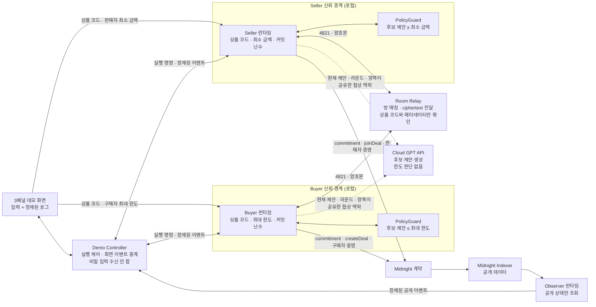

# Midnight Private Negotiation DApp v2 설계

**작성일:** 2026-07-25

**상태:** 승인된 통합 설계

**대상:** 새 3패널 웹 DApp, 역할별 에이전트 런타임, 암호화 Room Relay, Midnight 계약·Observer

**이전 버전:** 기존 구현은 [`../../../v1/README.md`](../../../v1/README.md)에 보존한다.

## 1. 목적

구매자와 판매자가 같은 4자리 상품 코드로 협상방에 참여하고 각자의 가격 한도를 역할별 로컬 private state에 저장한다. 두 AI 에이전트는 정확한 한도를 모델에 전달하지 않은 채 후보 가격을 생성하고, 로컬 `PolicyGuard`가 전송·수락 가능 여부를 집행한다.

협상이 성립하면 Midnight 회로가 다음 조건을 한도 원문 공개 없이 증명한 뒤 최종 합의 금액만 공개한다.

```text
합의 가격 p

p <= 구매자 최대 한도
판매자 최소 금액 <= p
```

발표에서 기억시킬 문장은 다음과 같다.

> 구매·판매 한도는 상대방과 공개 체인에 공개되지 않고, 협상이 성사되면 합의 금액만 온체인에 남는다.

## 2. 버전 경계와 저장소 구조

Counter 예제를 기반으로 만든 기존 데모는 `v1/` 아래에 실행 가능한 상태로 보존한다. 새 코드에서는 `counter`, `counter-cli`, `example-counter` 같은 레거시 명칭을 사용하지 않는다.

```text
.
├── v1/                              # 기존 Python·Midnight.js·Compact 데모
├── apps/
│   └── demo-web/                    # 새 3패널 웹 DApp
├── packages/
│   ├── demo-controller/             # 실행 제어와 정제된 화면 이벤트 중계
│   ├── buyer-runtime/               # Buyer private state·GPT·PolicyGuard
│   ├── seller-runtime/              # Seller private state·GPT·PolicyGuard
│   ├── room-relay/                  # 방 매칭과 암호문 전달
│   ├── observer-runtime/            # Indexer 공개 상태 조회
│   ├── negotiation-contract/        # 새 Compact 계약
│   └── protocol/                    # 명령·이벤트·암호화 envelope 타입
├── .calm-design/                    # 디자인 컨텍스트와 디자인 시스템
├── .superdesign/                    # 3패널 시각 설계
└── docs/                            # v2 설계·계획
```

`apps/`와 `packages/`는 구현 계획 승인 후 생성한다.

## 3. 사용자와 사용 맥락

### 직접 사용자

- 한 사람이 Buyer와 Seller 입력을 모두 조작한다.
- 화면을 녹화해 발표용 데모 영상을 만든다.
- 별도의 역할 선택 화면 없이 Buyer·Seller 패널 자체가 역할을 나타낸다.

### 영상 시청자

- 블록체인·ZK 경험이 섞인 기술 청중이다.
- 내부 PID, 지갑 주소, prover URL, 필드 목록, relay audit 원문보다 프라이버시 경계를 직관적으로 이해해야 한다.

### 발표자용 합성 화면의 한계

세 패널을 한 화면에 합성하므로 발표자와 영상 시청자는 입력 시점의 Buyer 최대 한도와 Seller 최소 금액을 볼 수 있다. 이 화면은 역할 격리를 설명하는 발표자용 관찰 화면이지, 인간 발표자로부터 양쪽 한도를 숨기는 운영 UI가 아니다.

운영형 제품으로 확장할 때는 Buyer와 Seller 화면을 별도 세션으로 분리해 각 사용자가 자기 한도만 보도록 한다.

## 4. 핵심 화면 구조

화면은 Midnight 헤더와 Buyer, Seller, Observer 세 패널로만 구성한다. 패널 순서는 고정한다.

```text
┌──────────────────────────────────────────────────────────────┐
│ MIDNIGHT | 비공개 협상 데모                                  │
├──────────────────┬──────────────────┬────────────────────────┤
│ BUYER            │ SELLER           │ OBSERVER               │
│ 역할별 입력      │ 역할별 입력      │ 공개 상태              │
│ 정제된 로그      │ 정제된 로그      │ 정제된 공개 로그       │
└──────────────────┴──────────────────┴────────────────────────┘
```

세 패널의 같은 폭은 일반적인 3열 기능 카드가 아니라 서로 다른 신뢰 경계를 동시에 비교하기 위한 프로토콜 시각화다.

## 5. 역할별 입력 상태

Buyer와 Seller는 각자 자기 패널에서 동일한 4자리 상품 코드를 입력한다. 공용 상품 코드 입력은 사용하지 않는다.

### Buyer

```text
입장 전
상품 코드  [ _ _ _ _ ]

코드 4821 입력 후
4821  ·  구매자 최대 한도  [             ] KRW

한도 110,000 입력 후
4821  ·  구매자 최대 한도  🔒 110,000 KRW
```

### Seller

```text
입장 전
상품 코드  [ _ _ _ _ ]

코드 4821 입력 후
4821  ·  판매자 최소 금액  [             ] KRW

금액 95,000 입력 후
4821  ·  판매자 최소 금액  🔒 95,000 KRW
```

### 입력 규칙

- 상품 코드는 숫자 네 자리다.
- Enter 또는 패널 내부 확인 동작으로 방에 입장한다.
- 코드를 제출하면 같은 위치가 역할별 한도 입력 행으로 전환된다.
- 금액은 양의 정수 KRW이며 표시할 때 천 단위 구분 쉼표를 사용한다.
- 금액 제출 후 해당 행은 잠긴 읽기 상태가 된다.
- 자물쇠는 “이 역할의 로컬 private state에 저장됨”을 뜻한다.
- 잠긴 금액은 해당 역할 패널에는 그대로 보인다.
- 상대 역할 런타임, Relay, GPT 입력, Observer 로그에는 한도를 전달하지 않는다.
- 값을 바꾸려면 현재 실행을 명시적으로 초기화하고 새 세션으로 시작한다.

## 6. 전체 실행 흐름

```text
Buyer·Seller가 같은 상품 코드 입력
→ 각자 한도 입력 및 로컬 private state 잠금
→ Buyer commitment 생성 및 createDeal
→ Seller commitment 생성 및 joinDeal
→ 역할별 GPT가 후보 제안 생성
→ 각 PolicyGuard가 로컬 한도로 후보 검사
→ 통과한 협상 메시지만 암호화하여 Relay 전송
→ 최대 6라운드 안에 합의 또는 결렬
→ 합의 시 Buyer 조건 증명
→ 합의 가격 opening을 Seller에게 암호화 전달
→ Seller 조건 증명 및 settle
→ Indexer 확인 후 최종 금액 표시
```

## 7. 시스템 아키텍처



## 8. 컴포넌트 책임

### 8.1 Demo Web

- Buyer와 Seller의 비밀 입력을 각 역할 런타임 전용 채널로 직접 전달한다.
- Demo Controller에는 비밀 입력을 보내지 않는다.
- 역할 런타임과 Observer가 발행한 정제된 이벤트만 렌더링한다.
- 협상 원문, GPT 프롬프트, 후보 목록, 폐기 결과를 렌더링하거나 브라우저 로그에 기록하지 않는다.

### 8.2 Demo Controller

- 역할 런타임 시작·중지·초기화 명령을 전달한다.
- 역할 런타임에서 이미 정제된 화면 이벤트를 패널로 중계한다.
- 최대·최소 한도, commitment randomness, 역할 비밀 키를 입력·보관·로그하지 않는다.
- 성공 상태는 Seller의 `settle` 호출과 Indexer의 `SETTLED` 확인이 모두 끝난 뒤에만 발행한다.

### 8.3 Buyer Runtime

- 상품 코드, 최대 한도, Buyer 역할 키, commitment randomness, 합의 가격 opening을 자기 private state에 저장한다.
- Buyer GPT 요청을 독립된 stateless 요청으로 생성한다.
- Buyer `PolicyGuard`로 후보 가격과 수락 가능 여부를 검사한다.
- `createDeal`과 `authorizeHiddenPrice`를 호출한다.

### 8.4 Seller Runtime

- 상품 코드, 최소 금액, Seller 역할 키, commitment randomness를 자기 private state에 저장한다.
- Seller GPT 요청을 Buyer와 분리된 stateless 요청으로 생성한다.
- Seller `PolicyGuard`로 후보 가격과 수락 가능 여부를 검사한다.
- `joinDeal`과 `settle`을 호출한다.

### 8.5 Room Relay

- 네 자리 상품 코드로 Buyer와 Seller를 같은 방에 매칭한다.
- 역할당 하나의 활성 연결만 허용한다.
- 상품 코드, 역할, 순서 번호, nonce, ciphertext만 전달한다.
- 암호문을 복호화하지 않으며 가격·대화·opening을 로그하지 않는다.
- 메시지 순서와 중복만 검사한다.

### 8.6 Observer Runtime

- 계약 주소와 Indexer endpoint만 입력받는다.
- 지갑, private state, proof server, GPT, Relay 복호화 키를 갖지 않는다.
- `WAITING_SELLER → OPEN → AUTHORIZED → SETTLED/CANCELLED` 공개 상태만 조회한다.
- 최종 가격은 `SETTLED`에서만 표시한다.

## 9. GPT 데이터 경계

GPT는 정책 집행자가 아니라 후보 생성기다.

### 허용 입력

```json
{
  "productCode": "4821",
  "round": 2,
  "role": "buyer",
  "sharedOffer": "100000",
  "sharedHistory": [
    { "round": 1, "action": "offer", "price": "95000" },
    { "round": 1, "action": "counter", "price": "100000" }
  ]
}
```

### 금지 입력

- Buyer 최대 한도
- Seller 최소 금액
- commitment randomness
- 역할 비밀 키와 지갑 seed
- `PolicyGuard` 통과·실패 결과
- 폐기된 후보와 폐기 횟수
- 상대 역할의 private state

### 출력

GPT는 최대 다섯 개의 후보를 우선순위 순으로 반환한다.

```json
{
  "candidates": [
    { "action": "counter", "price": "100000" },
    { "action": "counter", "price": "98000" }
  ]
}
```

- 출력은 구조화 스키마로 검증한다.
- 자연어 추론이나 chain-of-thought는 요청·Relay·화면 로그에 사용하지 않는다.
- 상대의 현재 제안이 로컬 조건을 만족하면 `PolicyGuard`가 직접 `accept`를 결정한다.
- GPT가 `accept`를 지시하더라도 로컬 정책 검사를 통과하지 않으면 실행하지 않는다.

### API 저장 설정

- Responses API 요청은 `store: false`로 설정한다.
- `store: false`는 요청 단위 application state 저장을 끄는 설정이며 조직 단위 Zero Data Retention과 같지 않다.
- 데모의 클라우드 모델 제공자는 양쪽 에이전트가 이미 공유한 제안과 협상 맥락을 추론 시점에 처리하는 신뢰 경계에 포함된다.
- 정확한 한도는 모델 입력에서 제외되므로 클라우드 모델 제공자도 한도 원문을 받지 않는다.
- 운영 확장 시 같은 모델 어댑터 인터페이스 뒤에 self-hosted 로컬 모델을 연결할 수 있다.

참조: [OpenAI API 데이터 제어](https://developers.openai.com/api/docs/guides/your-data#v1responses)

## 10. Stateless 후보 생성과 폐기

한 턴의 후보 생성 규칙은 다음과 같다.

```text
GPT → 후보 행동/금액 최대 5개 생성
PolicyGuard → 로컬 한도로 순서대로 검사
통과 → 첫 유효 후보를 암호화하여 Relay 전송
실패 → 외부 전송 및 화면·서버 로그 없이 전부 폐기
       이전 후보가 실패했다는 정보 없이 새 stateless 요청 수행
```

### 재요청 규칙

- 한 턴에 최대 세 번의 stateless 요청만 허용한다.
- 각 요청은 같은 공개 협상 상태를 입력으로 사용한다.
- 이전 요청의 후보, 실패 여부, 실패 이유, 시도 번호를 다음 요청에 포함하지 않는다.
- Buyer와 Seller의 API 요청 컨텍스트와 request lifecycle을 완전히 분리한다.
- 폐기와 재요청은 사용자 화면의 협상 스피너 뒤에서만 일어난다.
- 세 요청에서 유효 후보를 얻지 못하면 역할별 로컬 규칙 기반 전략이 안전한 후보나 종료 행동을 만든다.

이 방식은 모델이 반복되는 PolicyGuard 결과를 통해 한도에 관한 정보를 얻는 경로를 차단한다.

## 11. PolicyGuard 규칙

### Buyer

- 수신 제안 `p`가 `p <= buyerMax`이면 수락할 수 있다.
- 송신 후보는 `p <= buyerMax`인 경우에만 전송한다.
- 음수, 0, 정수 범위를 벗어난 값, 스키마가 잘못된 값은 폐기한다.

### Seller

- 수신 제안 `p`가 `sellerMin <= p`이면 수락할 수 있다.
- 송신 후보는 `sellerMin <= p`인 경우에만 전송한다.
- 음수, 0, 정수 범위를 벗어난 값, 스키마가 잘못된 값은 폐기한다.

### 공통

- 정책 판정은 로컬에서만 실행한다.
- 판정 결과는 GPT, Relay, Demo Controller, Observer에 전달하지 않는다.
- 합의 전 가격은 공개 화면 로그와 온체인 ledger에 쓰지 않는다.
- 정책 코드는 GPT 응답보다 우선하고 Midnight 회로가 최종 검증을 담당한다.

## 12. 협상 라운드

최대 협상 라운드는 6이다.

> 하나의 가격 제안과 상대방의 `accept`, `counter`, `reject` 응답까지를 1라운드로 센다.

```text
Round 1: Buyer 제안 → Seller 응답
Round 2: Seller counter → Buyer 응답
Round 3: Buyer counter → Seller 응답
...
Round 6 종료 시 미합의 → CANCELLED
```

- 정상적인 성공 데모는 2~3라운드를 목표로 한다.
- 내부 GPT 재요청은 협상 라운드에 포함하지 않는다.
- 6라운드까지 합의하지 못하면 가격 없이 협상 결렬로 끝낸다.
- Buyer·Seller 증명은 합의 후에만 시작한다.

## 13. Relay 암호화

Relay에는 다음 envelope만 평문으로 보인다.

```json
{
  "version": 1,
  "roomCode": "4821",
  "sender": "buyer",
  "sequence": 3,
  "nonce": "base64",
  "ciphertext": "base64"
}
```

### 세션 암호화

- 각 역할 런타임은 방 참여 시 임시 X25519 키 쌍을 생성한다.
- Relay를 통해 임시 공개 키만 교환한다.
- 공유 비밀에서 HKDF-SHA-256으로 세션 키를 파생한다.
- 협상 payload는 AES-256-GCM으로 암호화한다.
- `version`, `roomCode`, `sender`, `sequence`는 AAD로 인증한다.
- 모든 메시지는 고유한 96비트 nonce와 단조 증가 sequence를 사용한다.
- 중복 sequence, 재사용 nonce, 인증 태그 실패는 즉시 거부한다.

### 위협 모델

- v2 데모는 Relay를 honest-but-curious로 본다.
- Relay는 정상적으로 키를 전달하지만 암호문 내용을 읽으려 한다고 가정한다.
- 임시 공개 키에 별도 서명·온체인 바인딩이 없으므로 악의적 Relay의 능동적 중간자 공격까지 방어한다고 주장하지 않는다.
- 네 자리 상품 코드는 식별자일 뿐 비밀번호나 키 파생 재료로 사용하지 않는다.
- 운영 버전은 역할 키로 임시 전송 키를 인증하거나 온체인 역할 키와 바인딩해야 한다.

## 14. Midnight 계약 변경

기존 v1 계약은 가격을 `Uint<16>`으로 저장해 `110,000 KRW`를 표현할 수 없다. v2 계약은 한도와 가격을 최소 `Uint<64>`로 확장한다.

### 공개 ledger

- `dealId`
- Buyer 역할 공개 식별자
- Seller 역할 공개 식별자
- Buyer limit commitment
- Seller limit commitment
- agreed-price commitment
- 공개 상태
- `SETTLED` 이후의 final price

### private witness

- Buyer 최대 한도와 randomness
- Seller 최소 금액과 randomness
- 역할별 비밀 키
- 합의 가격과 price randomness

### 상태

```text
WAITING_SELLER
→ OPEN
→ AUTHORIZED
→ SETTLED

어느 완료 전 상태에서든 역할별 취소
→ CANCELLED
```

### 회로 책임

- `createDeal`: Buyer limit commitment로 계약 생성
- `joinDeal`: Seller limit commitment 등록
- `authorizeHiddenPrice`: `agreedPrice <= buyerMax`와 Buyer commitment opening 검증
- `settle`: `sellerMin <= agreedPrice`, Seller commitment opening, price commitment opening 검증
- 성공한 `settle`에서만 final price 공개

## 15. 상품 코드와 dealId

- 사람이 입력하는 상품 코드는 네 자리 방 코드다.
- 네 자리 값만으로 온체인 `dealId`를 만들면 반복 데모가 충돌할 수 있다.
- 실제 `dealId`는 `protocolVersion + roomCode + sessionNonce`를 도메인 분리해 32바이트로 해시한다.
- `sessionNonce`는 Buyer 런타임이 생성하고 Seller에게 방 handshake 일부로 전달한다.
- Observer에는 표시용 상품 코드와 실제 계약 주소를 정제된 공개 이벤트로 연결한다.

## 16. 화면 상태

### 로컬 데모 상태

```text
SETUP
→ ROOM_JOINED
→ LIMIT_LOCKED
→ WAITING_PEER
→ COMMITTING
→ NEGOTIATING
→ BUYER_VERIFYING
→ SELLER_VERIFYING
→ SETTLED | CANCELLED | ERROR
```

### 온체인 상태 매핑

| 화면 상태 | 온체인 상태 | 공개 금액 |
|---|---|---|
| `SETUP`–`COMMITTING` | 없음 또는 `WAITING_SELLER` | 없음 |
| `NEGOTIATING` | `OPEN` | 없음 |
| `BUYER_VERIFYING` | `OPEN` | 없음 |
| `SELLER_VERIFYING` | `AUTHORIZED` | 없음 |
| `SETTLED` | `SETTLED` | 최종 합의 금액 |
| `CANCELLED` | `CANCELLED` | 없음 |
| `ERROR` | 마지막 확인 상태 | 없음 |

## 17. 화면 이벤트와 로그 계약

역할 런타임과 Observer는 UI에 자유 형식 stdout을 직접 전달하지 않는다. 다음과 같은 정제된 이벤트만 Demo Controller에 보낸다.

```ts
type DemoEvent = {
  id: string;
  occurredAt: string;
  panel: "buyer" | "seller" | "observer";
  state:
    | "ROOM_JOINED"
    | "LIMIT_LOCKED"
    | "WAITING_PEER"
    | "COMMITTING"
    | "NEGOTIATING"
    | "BUYER_VERIFYING"
    | "SELLER_VERIFYING"
    | "SETTLED"
    | "CANCELLED"
    | "ERROR";
  messageCode: string;
  publicAmount?: string;
};
```

- `publicAmount`는 `SETTLED` 이벤트에서만 허용한다.
- UI가 `messageCode`를 한국어 문구로 변환한다.
- 자유 형식 예외 메시지, stack trace, 주소, commitment 원문을 그대로 렌더링하지 않는다.
- 모든 사용자용 로그는 `[HH:mm:ss] [SYSTEM] 메시지` 형식이다.
- `[PROOF]`, `[CHAIN]`, PID, wallet, prover, raw status 번호는 표시하지 않는다.

### 진행 로그

```text
[09:41:02] [SYSTEM] 상품 코드 4821 협상방에 입장했습니다.
[09:41:08] [SYSTEM] 구매자 조건을 로컬 비공개 상태에 저장했습니다.
[09:41:12] [SYSTEM] 거래 생성을 준비하고 있습니다.
[09:41:18] [SYSTEM] AI 에이전트가 비공개로 협상하고 있습니다. ⠋
[09:41:24] [SYSTEM] 구매자 조건을 공개하지 않고 증명하고 있습니다.
[09:41:31] [SYSTEM] 구매자 조건 증명이 완료되었습니다.
[09:41:36] [SYSTEM] 판매자 조건을 공개하지 않고 증명하고 있습니다.
```

진행 중 스피너는 한 줄에서 갱신하고 완료 시 다음 상태 로그로 교체한다. 폐기된 GPT 후보, 재요청, 제안 가격, 상대 응답 원문은 표시하지 않는다.

### 성공

```text
[09:41:43] [SYSTEM] 협상이 성사되었습니다.
[09:41:45] [SYSTEM] 최종 합의 금액은 100,000 KRW입니다.
[09:41:51] [SYSTEM] 합의 금액이 온체인에 기록되었습니다.
```

### 결렬

```text
[09:41:43] [SYSTEM] 협상이 결렬되었습니다.
[09:41:45] [SYSTEM] 공개된 금액은 없습니다.
```

## 18. 시각 디자인

- Midnight 기반 `#101010` canvas와 작은 `#0000FE` accent를 사용한다.
- Buyer, Seller, Observer는 같은 폭과 높이를 유지한다.
- 패널 배경은 중립색이며 역할색이나 상태색으로 채우지 않는다.
- 시간은 muted gray, 프로토콜 진행은 절제된 blue, private label은 amber, 성공은 muted green, 오류는 muted red를 텍스트에만 사용한다.
- 한국어 UI는 Pretendard, 터미널 로그는 시스템 monospace를 사용한다.
- 그라디언트, glow, glass, KPI 카드, 차트, 전체 체인 탐색기, macOS 신호등 장식을 사용하지 않는다.
- 반복 모션은 협상 중 터미널 스피너 하나만 허용한다.
- `prefers-reduced-motion`에서는 스피너를 정지된 글리프로 표시한다.
- 데스크톱 발표 화면을 우선하고 1024px 미만에서는 세 패널을 한 열로 쌓는다.

## 19. 오류 처리

| 상황 | 내부 처리 | 사용자 표시 |
|---|---|---|
| 네 자리 코드 형식 오류 | 방 입장 거부 | 입력 필드 아래 형식 오류 |
| 서로 다른 상품 코드 | 서로 다른 방에서 대기 | `상대 역할을 기다리고 있습니다.` |
| 같은 역할 중복 접속 | 두 번째 연결 거부 | `이미 연결된 역할이 있습니다.` |
| GPT timeout·스키마 오류 | stateless 재요청, 최대 3회 | 협상 스피너 유지 |
| 모든 GPT 후보 정책 위반 | 후보 폐기 후 stateless 재요청 | 협상 스피너 유지 |
| 로컬 fallback도 행동 생성 불가 | 기술 오류로 실행 종료 | `협상을 계속할 수 없습니다.` |
| 6라운드 미합의 | 역할별 취소 회로 실행 | `협상이 결렬되었습니다.` |
| Relay 중복·순서 오류 | envelope 거부 | `협상 연결을 확인할 수 없습니다.` |
| 암호문 인증 실패 | 복호화 거부, 세션 종료 | `협상 연결을 확인할 수 없습니다.` |
| Buyer 증명 실패 | `AUTHORIZED`로 진행하지 않음 | `구매자 조건을 증명하지 못했습니다.` |
| Seller 증명 실패 | `SETTLED`로 진행하지 않음 | `판매자 조건을 증명하지 못했습니다.` |
| 트랜잭션 제출 실패 | 재시도 가능 상태 유지 | `온체인 기록을 완료하지 못했습니다.` |
| Indexer 지연 | 성공 표시 보류 후 polling | `온체인 확인을 기다리고 있습니다.` |
| Observer 연결 실패 | 거래 성공 주장 금지 | `공개 상태를 확인할 수 없습니다.` |

기술 실패와 조건 불일치에 따른 정상 결렬을 구분한다. 기술 실패를 `CANCELLED` 협상 결과처럼 표시하지 않는다.

## 20. 프라이버시 보장과 비보장

### 보장

- 한도 원문을 공개 ledger와 Observer에 기록하지 않는다.
- Buyer와 Seller는 상대 한도 원문을 받지 않는다.
- GPT 입력에 한도, randomness, PolicyGuard 결과를 포함하지 않는다.
- Relay는 honest-but-curious 위협 모델에서 협상 payload 원문을 읽지 못한다.
- 실패한 협상에서는 가격을 공개 화면과 ledger에 남기지 않는다.
- 성공 시 final price만 공개한다.

### 보장하지 않음

- 발표자용 합성 화면을 보는 사람에게 입력 순간의 두 한도를 숨기지 않는다.
- 클라우드 GPT 제공자로부터 양쪽이 이미 공유한 제안과 협상 맥락을 숨기지 않는다.
- `store: false`만으로 Zero Data Retention을 보장하지 않는다.
- 반복되는 공개 제안으로 상대의 한도를 통계적으로 추정하는 가능성을 제거하지 않는다.
- 최종 가격이 드러내는 `buyerMax >= finalPrice`, `sellerMin <= finalPrice` 관계를 숨기지 않는다.
- v2 데모의 임시 키 교환은 악의적 Relay의 능동적 중간자 공격을 방어하지 않는다.
- 상품·재고·지불 능력·한도의 진실성은 증명하지 않는다.
- 실제 토큰 결제와 원자적 자산 교환은 포함하지 않는다.

## 21. 테스트와 완료 기준

### 협상

- 겹치는 한도에서 2~3라운드 성공 시나리오가 재현된다.
- 겹치지 않는 한도에서 6라운드 이내 또는 종료 정책에 따라 금액 없이 결렬된다.
- GPT 응답이 잘못되거나 모든 후보가 무효여도 private 판정이 외부로 노출되지 않는다.
- Buyer와 Seller의 GPT 요청 기록에 상대·자기 한도 원문이 없다.

### 격리

- Buyer private state에 Seller 한도·randomness·secret이 존재하지 않는다.
- Seller private state에 Buyer 한도·randomness·secret이 존재하지 않는다.
- Demo Controller 이벤트에 한도·난수·비밀 키가 없다.
- Relay audit에는 envelope 필드만 있고 복호화된 가격·opening이 없다.
- Observer 구성에 wallet, private state, proof server, GPT key가 없다.

### 암호화

- Relay가 캡처한 ciphertext만으로 협상 payload를 복원할 수 없다.
- nonce 재사용, sequence replay, 인증 태그 변조가 거부된다.
- 상품 코드만으로 세션 키를 계산할 수 없다.

### 계약

- `Uint<64>` 범위에서 `95,000`, `100,000`, `110,000 KRW`를 처리한다.
- 잘못된 Buyer commitment opening을 거부한다.
- 합의 가격이 Buyer 최대 한도를 초과하면 거부한다.
- 합의 가격이 Seller 최소 금액보다 낮으면 거부한다.
- price commitment opening 불일치를 거부한다.
- 성공 전 `finalPrice`는 0이고 성공 후에만 합의 금액이다.

### UI

- Buyer와 Seller가 각자 네 자리 상품 코드를 입력할 수 있다.
- 코드 입력 후 같은 위치가 역할별 금액 입력으로 전환된다.
- 금액 잠금 후 자기 패널에 자물쇠와 포맷된 값이 보인다.
- Buyer와 Seller 로그 형식과 간격이 동일하다.
- 협상 중에는 스피너와 고정 상태 문구만 보인다.
- 폐기 후보, 재요청, 협상 원문, 중간 가격이 어느 패널에도 나타나지 않는다.
- Observer는 공개 상태와 성공한 final price만 표시한다.
- 실패 화면은 어떠한 가격도 표시하지 않는다.
- 데스크톱 3열과 1024px 미만 단일 열 레이아웃에서 가로 스크롤이 없다.
- 키보드 포커스, 44px 조작 영역, WCAG AA 대비, reduced motion을 만족한다.

## 22. 구현 계획으로 넘길 결정

다음 항목은 제품 요구가 아니라 구현 선택이므로 별도 구현 계획에서 파일·라이브러리·작업 순서로 구체화한다.

- 웹 프레임워크와 역할 런타임 transport
- 프로세스 실행 방식과 개발용 orchestration
- OpenAI 모델명과 SDK 버전
- X25519·HKDF·AES-GCM 구현 라이브러리
- 로컬 모델 어댑터 구현 시점
- 배포 환경과 CI

이 선택들은 본 문서의 신뢰 경계, 데이터 최소화, 이벤트 계약, 라운드 규칙을 변경해서는 안 된다.
